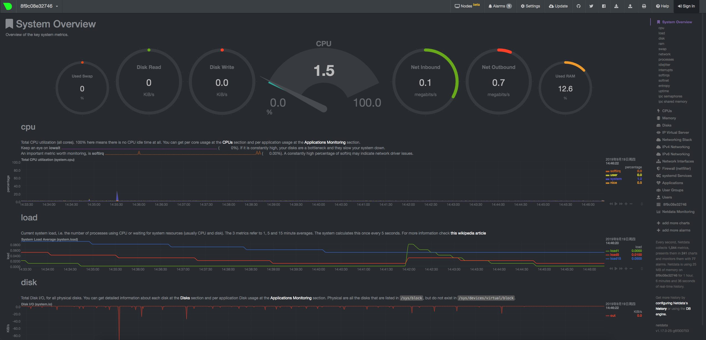
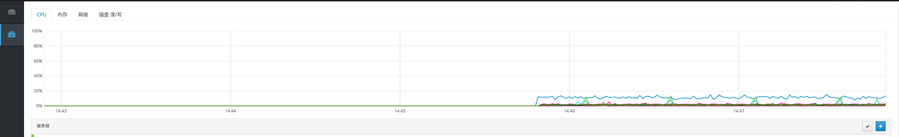
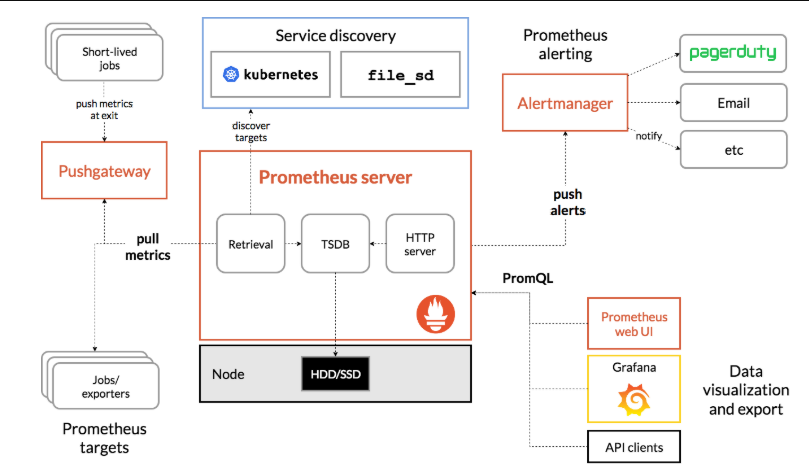
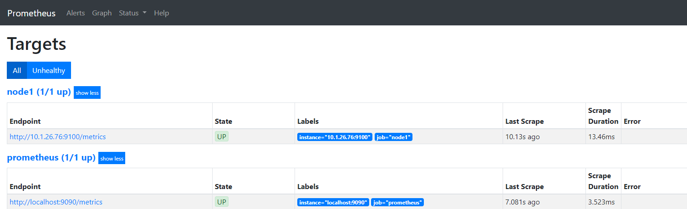
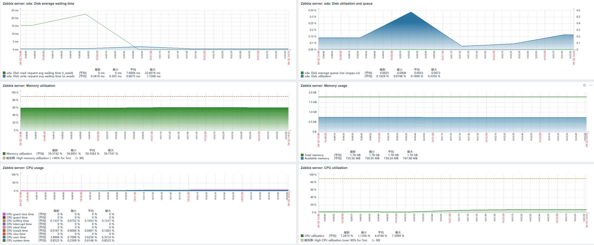
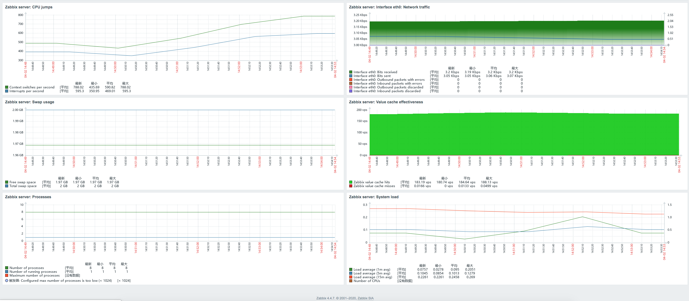

该项目后期将逐步减缓直至停止更新，脚本部署方式逐渐改为`ansible-playbook`的方式，新的项目地址：[ansible-linux](https://github.com/Leif160519/ansible-linux)

# 一、注意事项
## 1. 此脚本适用于Centos 7，部分脚本内容包含Ubuntu下的用法，可根据实际情况进行变更
## 2. 脚本中涉及的IP地址和路径可以根据实际情况进行更改，但是有些路径是固定的，更改过后会出现问题，故在运行之前先了解一下工作原理
## 3. 部分脚本在运行过程中自带彩色字体输出，某些脚本执行一定流程过后需要手动操作，并非无人值守，请执行前先看一下执行步骤，涉及手动操作和其他命令的提示用黄色表示，密码提示等用红色表示
## 4.部分脚本已经与ansible-linux中的playbook保持逻辑一致。

# 二、文件介绍
## 1. install.sh
centos 基础环境安装，包括常用组件和一些运维工具(以下表格内容不全)：

| 序号 | 软件名称 | 说明 | 使用方法 |
| --- | --- | --- | --- |
| 1 | wget | wget命令用来从指定的URL下载文件 | [wget命令](https://man.linuxde.net/wget) |
| 2 | nano | nano是一个字符终端的文本编辑器，有点像DOS下的editor程序 | [nano命令](https://man.linuxde.net/nano) |
| 3 | zip | zip命令可以用来解压缩文件，或者对文件进行打包操作 | [zip命令](https://man.linuxde.net/zip) |
| 4 | unzip | unzip命令用于解压缩由zip命令压缩的“.zip”压缩包 | [unzip命令](https://man.linuxde.net/unzip) |
| 5 | git | Git 的工作就是创建和保存你项目的快照及与之后的快照进行对比 | [Git 基本操作](https://www.runoob.com/git/git-basic-operations.html) |
| 6 | java | 不解释 |  |
| 7 | yum-utils | yum工具包 |  |
| 8 | expect | Expect是Unix系统中用来进行自动化控制和测试的软件工具 | [Expect—百科篇命令](https://man.linuxde.net/expect-%e7%99%be%e7%a7%91%e7%af%87) |
| 9 | htop | 实时的监控界面 | [htop使用详解--史上最强（没有之一）](https://cloud.tencent.com/developer/article/1115041) |
| 10 | iotop | iotop命令是一个用来监视磁盘I/O使用状况的top类工具 | [iotop命令](https://man.linuxde.net/iotop) |
| 11 | iftop | 查看实时的网络流量，监控TCP/IP连接等 | [Linux流量监控工具 - iftop (最全面的iftop教程)](https://www.vpser.net/manage/iftop.html) |
| 12 | nethogs | NetHogs是一个开源的命令行工具（类似于Linux的top命令），用来按进程或程序实时统计网络带宽使用率 | [nethogs命令](https://man.linuxde.net/nethogs) |
| 13 | mrtg | MRTG 是通过SNMP 协议，向运行snmp协议主机询问相关的资料后，主机传递数值给MRTG ，然后MRTG 再绘制成网页上的图表 | [mrtg 简单好用的网络流量监控工具](https://blog.51cto.com/dngood/762802) |
| 14 | nagios | Nagios是一款开源的电脑系统和网络监视工具，能有效监控Windows、Linux和Unix的主机状态，交换机路由器等网络设置，打印机等 | [Linux下Nagios的安装与配置](https://www.cnblogs.com/mchina/archive/2013/02/20/2883404.html) |
| 15 | cacti | Cacti是一套基于PHP、MySQL、SNMP及RRDTool开发的网络流量监测图形分析工具 | [Linux 监控工具之Cacti使用详解（一）](https://blog.51cto.com/freeloda/1308140) |
| 16 | npm | NPM是随同NodeJS一起安装的包管理工具 | [NPM 使用介绍](https://www.runoob.com/nodejs/nodejs-npm.html) |
| 17 | pv | 显示当前在命令行执行的命令的进度信息，管道查看器 | [pv](https://wangchujiang.com/linux-command/c/pv.html) |
| 18 | telnet | telnet命令用于登录远程主机，对远程主机进行管理 | [telnet命令](https://man.linuxde.net/telnet) |
| 19 | net-tools | centos网络工具包 |  |
| 20 | tree | tree命令以树状图列出目录的内容 | [tree命令](https://man.linuxde.net/tree) |
| 21 | tmux | tmux是一款优秀的终端复用软件 | [Tmux使用手册](http://louiszhai.github.io/2017/09/30/tmux/) / [Tmux 使用教程](https://www.ruanyifeng.com/blog/2019/10/tmux.html) |
| 22 | iperf | iperf命令是一个网络性能测试工具 | [iperf命令](https://man.linuxde.net/iperf) |
| 23 | figlet | 将普通终端文本转换为大字母 | [Figlet 和 Toilet命令用法](https://www.linuxprobe.com/figlet-toilet-command.html) |
| 24 | lsof | lsof命令用于查看你进程开打的文件，打开文件的进程，进程打开的端口(TCP、UDP) | [lsof命令](https://man.linuxde.net/lsof) |
| 25 | dpkg | dpkg命令是Debian Linux系统用来安装、创建和管理软件包的实用工具 | [dpkg命令](https://man.linuxde.net/dpkg) |
| 26 | hdparm | hdparm命令提供了一个命令行的接口用于读取和设置IDE或SCSI硬盘参数 | [hdparm命令](https://man.linuxde.net/hdparm) |
| 27 | smartmontools | 是类Unix系统下实施SMART任务命令行套件或工具，它用于打印SMART自检和错误日志，启用并禁用SMRAT自动检测，以及初始化设备自检 | [Linux 硬盘监控和分析工具：smartctl](https://leif.fun/articles/2019/08/22/1566473324516.html) |
| 28 | killall | killall命令使用进程的名称来杀死进程，使用此指令可以杀死一组同名进程 | [killall命令](https://man.linuxde.net/killall)|
| 29 | fping | Fping程序类似于ping协议回复请求以检测主机是否存在 | [Fping命令解析](https://blog.csdn.net/wz_cow/article/details/80967255) |
| 30 | tcpdump | tcpdump命令是一款sniffer工具，它可以打印所有经过网络接口的数据包的头信息，也可以使用-w选项将数据包保存到文件中，方便以后分析 | [tcpdump命令](https://man.linuxde.net/tcpdump) |
| 31 | nmap | nmap命令是一款开放源代码的网络探测和安全审核工具，它的设计目标是快速地扫描大型网络 | [nmap命令](https://man.linuxde.net/nmap) |
| 32 | fio | fio是一个IO测试工具，可以运行在Linux、Windows等多种系统之上，可以用来测试本地磁盘、网络存储等的性能 | [fio的简单介绍及部分参数翻译](https://blog.csdn.net/MrSate/article/details/53292102) |
| 33 | nc | nc命令是netcat命令的简称，都是用来设置路由器 | [nc/netcat命令](https://man.linuxde.net/nc_netcat) |
| 34 | strace | strace命令是一个集诊断、调试、统计与一体的工具 | [strace命令](https://man.linuxde.net/strace) |
| 35 | perf | 性能分析工具 | [在Linux下做性能分析3：perf](https://zhuanlan.zhihu.com/p/22194920) |
| 36 | iostat | iostat命令被用于监视系统输入输出设备和CPU的使用情况 | [iostat命令](https://man.linuxde.net/iostat) |
| 37 | dig | dig命令是常用的域名查询工具，可以用来测试域名系统工作是否正常 | [dig命令](https://man.linuxde.net/dig) / [dig命令](https://man.linuxde.net/dig-2) |
| 38 | nslookup | nslookup命令是常用域名查询工具，就是查DNS信息用的命令 | [nslookup命令](https://man.linuxde.net/nslookup) |
| 39 | dstat | dstat命令是一个用来替换vmstat、iostat、netstat、nfsstat和ifstat这些命令的工具 | [dstat命令](https://man.linuxde.net/dstat) |
| 40 | lynx | lynx命令是终端上的纯文本模式的网页浏览器，没有JS引擎，不支持CSS排版、图形、音视频等多媒体信息。只能作为一个很有趣的小玩具。| [lynx命令 – 终端上的纯文本浏览器](https://www.linuxcool.com/lynx) |
| 41 | w3m | w3m是个开放源代码的命令行下面的网页浏览器。| [w3m常用操作](http://blog.lujun9972.win/blog/2016/12/11/w3m%E5%B8%B8%E7%94%A8%E6%93%8D%E4%BD%9C/index.html) |
| 42 | lrzsz | rz：运行该命令会弹出一个文件选择窗口，从本地选择文件上传到服务器(receive)，即windows上传到linux服务器;sz：将选定的文件发送（send）到本地机器，即从linux服务型下载到windows ||
| 43 | monit | Monit是一款功能非常丰富的进程、文件、目录和设备的监测软件，适用于Linux/Unix平台。它可以自动修复那些已经停止运作的程序，特别适合处理那些由于多种原因导致的软件错误、监控系统关键的进程和资源。同时Monit 包含一个内嵌的 HTTP(S) Web 界面，你可以使用浏览器方便地查看 Monit 所监视的服务器。此外，M/Monit可以把多台安装Monit的服务器集中起来一起管理。| [Monit：开源服务器监控工具](https://www.cnblogs.com/52fhy/p/6412547.html) |


## 2. config.sh
系统配置
|  序号 |  软件/操作名称 |  作用 |
| --- | --- | --- |
| 1 | 关闭swap分区 |  |
| 2 | 关闭防火墙 |  |
| 3 | 关闭SSH DNS反向解析和GSSAPI的用户认证  | 防止ssh超时掉线 |
| 4 | 设置所有sudo指令不需要密码 |
| 5 | 给pip换源 |
| 6 | 配置vim |
| 7 | 配置关机等待时间 |

> 补充：[Linux 常用命令集合](https://www.runoob.com/w3cnote/linux-common-command.html)


## 3. docker.sh
安装 *`Docker`* 和 *`docker-compose`*

## 4. gitlab.sh
安装 *`Gitlab`* ，支持中文(登录过后在setting中设置语言即可)，设置包括：

1.安装 *`SSH `* ----------------------------------------------------(一般Linux都自带，支持SSH克隆或者提交代码)，

2.安装 *`邮件服务器`* ----------------------------------------------------(git注册和找回密码合并代码等发送邮件用)，

3.安装 *`Gitlab 社区版`*

4.设置 *`定时任务，每天凌晨两点，执行gitlab备份`* 

5.设置 *`gitlab域名`* --------------------------------------------------------------------------(形成正确的仓库连接)，

6.设置 *`备份保存时间，默认7天`* 

> 备份时间和备份保存时间可根据实际情况修改

> 查看gitlab版本号`cat /opt/gitlab/embedded/service/gitlab-rails/VERSION`

> gitlab相关资料：
> - [Gitlab如何进行备份恢复与迁移？](https://leif.fun/articles/2019/08/29/1567060138639.html)
> - [完全卸载GitLab](https://leif.fun/articles/2019/08/29/1567058106789.html)
> - [centos搭建gitlab社区版](https://leif.fun/articles/2019/08/29/1567057627672.html)
> - [解决Gitlab迁移服务器后SSH key无效的问题](https://leif.fun/articles/2019/08/22/1566472573139.html)

## 5. mongodb.sh
安装 *`MongoDB`* 数据库

- *`MongoDB`* 默认没有用户名和密码，可以用Navicat等数据库管理工具直接连接

> mongodb相关资料：
> - [MongoDB 备份(mongodump)与恢复(mongorestore)](https://leif.fun/articles/2019/08/30/1567127999119.html)
> - [开启mongodb远程访问](https://leif.fun/articles/2019/08/30/1567127345260.html)
> - [mongodb服务启动失败](https://leif.fun/articles/2019/08/30/1567127175232.html)
> - [升级 MongoDB 到 4.0](https://leif.fun/articles/2019/08/30/1567127101249.html)

## 6. mysql
### 6.1 mysql-yum.sh
安装 *`MySQL`* 数据库社区版，脚本主要设置了固定密码。

关于如何开启远程访问(centos 7下)：

1.登录进mysql
```
mysql -u root -p
```
2.更新表内容
```
grant all privileges on *.* to 'root' @'%' identified by '你的root用户密码’;
```
3.刷新权限
```
flush privileges;
```

> [mysql相关内容](https://leif.fun/search?keyword=mysql)

附：[mysql5.7安装包(rpm)](https://centos.pkgs.org/7/mysql-5.7-x86_64/)

### 6.2 mysql-tar.sh
安装mysql压缩版

## 7.python3.7.sh
编译安装 *`Python3.7`*

安装pip并升级到最新版
> [python相关内容](https://leif.fun/search?keyword=python)


## 8. rabbitmq.sh
安装 *`RabbitMQ`* 消息通知

> 访问端口号 *`16572`* ， 用户名 *`admin`*  ，密码 *`123456`* 

erlang下载:[github](https://github.com/rabbitmq/erlang-rpm/releases)

| 描述 | 下载 |
| --- | --- |
| 适用于运行RabbitMQ的CentOS 7的零依赖Erlang / OTP 21.3.8.1软件包 | [erlang-21.3.8.1-1.el7.x86_64.rpm](https://github.com/rabbitmq/erlang-rpm/releases/download/v21.3.8.1/erlang-21.3.8.1-1.el7.x86_64.rpm) |
| 适用于运行RabbitMQ的CentOS 6的零依赖Erlang / OTP 21.3.8.1软件包 | [erlang-21.3.8.1-1.el6.x86_64.rpm](https://github.com/rabbitmq/erlang-rpm/releases/download/v21.3.8.1/erlang-21.3.8.1-1.el6.x86_64.rpm) |

>截止2019年05月16日，rabbitmq官网暂未更新erlang 21.3.8.1版本

RabbitMQ下载:[github]( https://github.com/rabbitmq/rabbitmq-server/releases/)

| 描述 | 下载 |
| --- | --- |
| 适用于RHEL Linux 7.x，CentOS 7.x，Fedora 19+的RPM（支持systemd） | [rabbitmq-server-3.7.14-1.el7.noarch.rpm](https://github.com/rabbitmq/rabbitmq-server/releases/download/v3.7.14/rabbitmq-server-3.7.14-1.el7.noarch.rpm) |
| 适用于RHEL Linux 6.x，CentOS 6.x，Fedora之前的RPM | [rabbitmq-server-3.7.14-1.el6.noarch.rpm](https://github.com/rabbitmq/rabbitmq-server/releases/download/v3.7.14/rabbitmq-server-3.7.14-1.el6.noarch.rpm) |
| openSUSE Linux的RPM | [rabbitmq-server-3.7.14-1.suse.noarch.rpm](https://github.com/rabbitmq/rabbitmq-server/releases/download/v3.7.14/rabbitmq-server-3.7.14-1.suse.noarch.rpm) |
| SLES 11.x的RPM|[rabbitmq-server-3.7.14-1.sles11.noarch.rpm](https://github.com/rabbitmq/rabbitmq-server/releases/download/v3.7.14/rabbitmq-server-3.7.14-1.sles11.noarch.rpm)|

>截止2019年05月16日，rabbitmq官网暂未更新rabbitmq 3.7.14版本


## 9. supervisor.sh
安装 *`supervisor`* 进程管理工具设置应用程序开机自启动

- 上述 *`base.sh`* 设置了 *`supervisor`* 的管理界面，端口号 *`9001`* ，用户名 *`admin`* ，密码 *`123456`*

- 具体安装教程：[centos7安装supervisor](https://leif.fun/articles/2019/08/28/1566986488665.html)

## 10.[monitor](monitor)
监控软件
### 10.1 [netdata](https://github.com/Leif160519/netdata)
Linux硬件资源监控软件，默认访问端口`1999`

> 部署教程参考:[netdata监控搭建及使用](https://leif.fun/articles/2019/09/10/1568097487995.html)

### 10.2 [goaccess](https://github.com/Leif160519/goaccess)
分析nginx日志的工具，默认访问端口`7890`

> 部署教程参考:[(超级详细)使用GoAccess分析Nginx日志的安装和配置](https://leif.fun/articles/2019/09/10/1568098665037.html)

### 10.3 [cockpit](monitor/cockpit.sh)
轻量级硬件资源监控软件，默认访问端口`9090`，用户名为Linux用户名，密码为Linux登录密码




### 10.4 [Prometheus(p8s)](https://github.com/Leif160519/prometheus)
开源的监控系统，访问端口`9090`，`node_porter`访问端口`9100`






### 10.5 [Grafana](https://github.com/Leif160519/grafana)
功能强大的监控图形程序，可以接受多个监控平台的数据源。访问端口`3000`,默认用户名：*`admin`，密码：*`admin`。


[Node Exporter Full模板JSON文件](https://grafana.com/api/dashboards/1860/revisions/20/download)

[Dashboard模板仓库](https://grafana.com/grafana/dashboards)

> 参考资料：
> - [Grafana官网](https://grafana.com/grafana/download)
> - [CentOS 7中安装和配置Grafana](http://easonwu.me/2019/07/install-grafana-on-centos7.html)
> - [对接Grafana](https://www.alibabacloud.com/help/zh/doc-detail/109434.htm)

### 10.6. [zabbix](https://github.com/Leif160519/zabbix)
安装zabbix服务，使用`zabbix-linux.sh`前提需要安装`mysql`(mysql不能装在docker中，否则zabbix-server不可用)。
个人推荐`zabbix-docker.sh`，比较方便。






> 参考资料：
> - [【Zabbix】CentOS7.3下使用Docker安装Zabbix](https://www.jianshu.com/p/b2d44c733c2d)
> - [Linux老司机带你学Zabbix从入门到精通（一）](https://zhuanlan.zhihu.com/p/35064593)
> - [Linux老司机带你学Zabbix从入门到精通（二）](https://zhuanlan.zhihu.com/p/35068409)
> - [基于 docker 部署 zabbix 及客户端批量部署](https://blog.rj-bai.com/post/144.html)

## 11. [k8s](k8s)
centos下k8s安装脚本

> k8s相关资料：
> - [Kubernetes相关资料](https://leif.fun/articles/2019/09/06/1567758755140.html)
> - [Kubernetes 部署失败的 10 个最普遍原因（Part 1）](https://leif.fun/articles/2019/09/06/1567758470060.html)
> - [CentOS7.5 Kubernetes V1.13 二进制部署集群](https://leif.fun/articles/2019/09/06/1567755955285.html)
> - [《每天5分钟玩转Kubernetes》读书笔记](https://leif.fun/articles/2019/09/18/1568772630383.html)

## 12.oh-my-zsh.sh
安装zsh配置oh-my-zsh

## 13.node.sh
安装node和npm

## 14. ldap.sh
LDAP是Lightweight Directory Access Protocol ， 即轻量级目录访问协议， 用这个协议可以访问提供目录服务的产品

> 参考资料：
> - [Centos7 搭建openldap完整详细教程(真实可用)](https://blog.csdn.net/weixin_41004350/article/details/89521170)
> - [OpenLDAP管理工具之LDAP Admin](https://cloud.tencent.com/developer/article/1380076)
> - [Gitlab使用LDAP用户管理配置](https://blog.csdn.net/qq_40140473/article/details/96312452)
> - [gitlab详细配置ldap](https://blog.csdn.net/len9596/article/details/81222764)

## 15. [scl使用指南](scl使用指南/scl使用指南.md)

## 16.chrome.sh
centos 7(Desktop版)安装chrome浏览器

## 17.ethernet.sh
修改centos的有线IP地址

## 18.nfs.sh
安装网络文件系统（Network File System）NFS

## 19.samba.sh
安装服务信息块（Server Messages Block）文件共享软件samba

## 20.rar.sh
编译安装rar

# 三、用法

推荐执行顺序：
- repository.sh - 换源
- install.sh    - 安装常用组件
- config.sh     - 系统配置
- ethernet.sh   - 固定ip地址
- ···.sh        - 其他特定软件的安装脚本

Good Luck！
