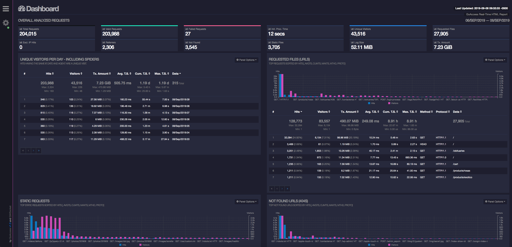
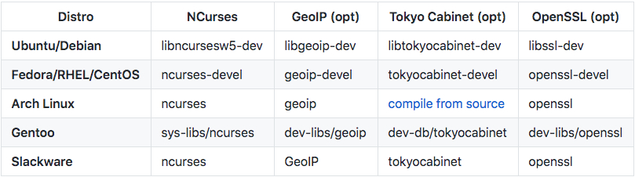
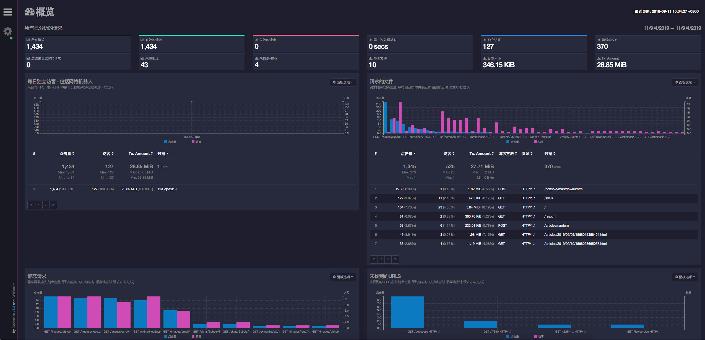
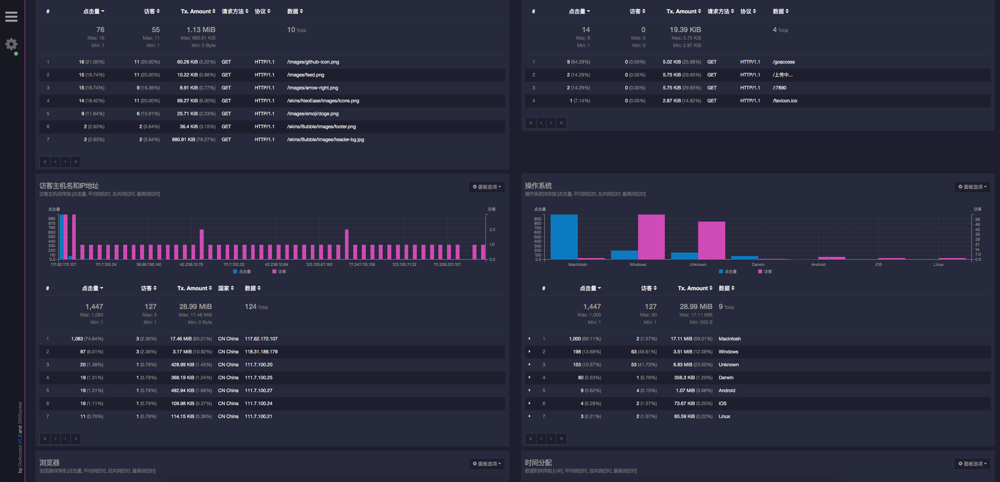
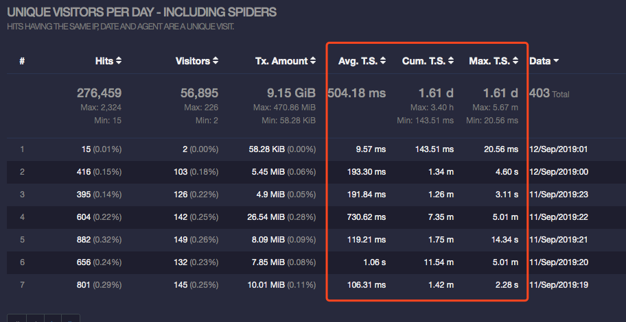
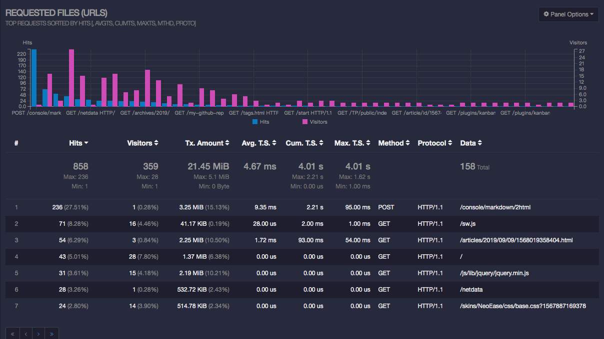

- 官网地址：https://goaccess.io/
- 官方github地址：https://github.com/allinurl/goaccess
- 官方demo地址：https://rt.goaccess.io/?20190828082924



## 一、前言

[GoAccess在GitHub的源码库](https://github.com/allinurl/goaccess)上已经给出了多种安装方式，源码编译，apt-get，docker等，挑一种自己喜欢的就可以了。这里需要说明的是，如果想要使用某些特性如地理位置，ssl连接等的话，则需要编译安装，可以先将依赖装好，再编译安装即可。

## 二、安装

### 1.centos编译安装

```
#安装依赖
yum -y install gcc make GeoIP-devel ncurses-devel
wget https://tar.goaccess.io/goaccess-1.3.tar.gz
tar -xzvf goaccess-1.3.tar.gz
cd goaccess-1.3/
./configure --enable-utf8 --enable-geoip=legacy
make
make install
```

> 执行configure配置，根据需要选用配置项，可以通过 `./configure --help`查看可选参数。

**配置选项**

> 可以使用多个选项配置GoAccess。有关配置选项的完整最新列表，请运行 `./configure --help`

* `--enable-debug`：使用调试符号进行编译并关闭编译器优化。
* `--enable-utf8`：编译具有广泛的字符支持。
* `--enable-geoip=<legacy|mmdb>`：使用GeoLocation支持进行编译。MaxMind的GeoIP是必需的。`legacy`将使用原始的GeoIP数据库。`mmdb`将使用增强的GeoIP2数据库。
* `--enable-tcb=<memhash|btree>`：与Tokyo Cabinet存储支持一起编译。`memhash`将利用Tokyo Cabinet的内存中哈希数据库。`btree`将利用Tokyo Cabinet的磁盘B + Tree数据库。
* `--disable-zlib`：在B + Tree数据库上禁用zlib压缩。
* `--disable-bzip`：禁用B + Tree数据库上的bzip2压缩。
* `--with-getline`：动态扩展行缓冲区以解析整行请求，而不是使用4096的固定大小缓冲区。
* `--with-openssl`：使用OpenSSL编译GoAccess，支持其WebSocket服务器。

> 不需要走 https 的话可以去掉 --with-openssl 选项

### 2.centos包管理器安装

如果使用 `yum install goaccess`直接安装，需要先安装epel源。

```
sudo yum install -y epel-release
```

#### 安装排错

由于官网并未提供安装之前的依赖包，故安装之后会出现如下错误
**FAQ：**

**根据错误提示解决依赖关系：**

**configure: error:**

***Missing development files for the GeoIP library***

**安装需要的软件包**

```
yum install -y GeoIP-devel
```

**再次运行预编译命令并根据错误提示解决依赖关系：**

**configure: error:**

**Missing development libraries for ncursesw**

**安装需要的软件包：**

```
yum install -y ncurses-devel
```

附上各个平台依赖包列表



### 3.ubuntu包管理器安装

```
apt-get install goaccess
```

> 上述方法安装的goaccess只是1.2版本的，故需要升级，方法见下

```
echo "deb https://deb.goaccess.io/ $(lsb_release -cs) main" | sudo tee -a /etc/apt/sources.list.d/goaccess.list
wget -O - https://deb.goaccess.io/gnugpg.key | sudo apt-key add -
sudo apt-get update
sudo apt-get install goaccess
```

### 4.ubuntu编译安装

```
#安装依赖库
apt-get install libncursesw5-dev libssl-dev libgeoip-dev
#安装编译依赖的包
apt-get install gcc make
wget https://tar.goaccess.io/goaccess-1.3.tar.gz
tar -xzvf goaccess-1.3.tar.gz
cd goaccess-1.3/
./configure --enable-utf8 --enable-geoip=legacy
make
make install
```

## 三、检测goaccess版本

```
root@ubuntu:~# goaccess --version
GoAccess - 1.3.
For more details visit: http://goaccess.io
Copyright (C) 2009-2016 by Gerardo Orellana

Build configure arguments:
  --enable-utf8
  --enable-geoip=legacy
```

若添加了openssl编译参数的话，效果如下：

```
[root@ubuntu]~# goaccess --version
GoAccess - 1.3.
For more details visit: http://goaccess.io
Copyright (C) 2009-2016 by Gerardo Orellana

Build configure arguments:
  --enable-utf8
  --enable-geoip=legacy
  --with-openssl
```

## 四、配置

### 1.首先机器上得有nginx环境

### 2.goaccess配置

选择一个路径存放goaccess的配置文件，这里我选择 `/usr/local/src/goaccess`目录
新建goaccess.conf，内容如下：

```
time-format %H:%M:%S
date-format %d/%b/%Y
log-format %h %^[%d:%t %^] "%r" %s %b "%R" "%u"
real-time-html true
port <port>
ssl-cert <cert.crt>
ssl-key <priv.key>
ws-url wss://<your-domain>:<port>
output /usr/local/src/goaccess/index.html
log-file /usr/local/src/goaccess/goaccess.log
```

**参数解释**

* real-time-html 用来使用实时刷新特性；
* port 是用来和浏览器通信的，选一个没被占用的就行（别忘了在防火墙里开启端口)；
* 如果你不走 https 的话，ssl-cert，ssl-key，ws-url都不是必需的；
* output：存放goaccess的站点目录;
* log-file:goaccess的日志文件，后来发现运行后里面都是空的，暂时不知道为啥 ;

需要注意的几点
三个 format 的设置要与 nginx 的设置一致，当然如果你像我这样根本没改过 nginx 的日志格式的话就用这个就行了；
nginx中的日志格式如下：

```
log_format  main  '$remote_addr - $remote_user [$time_local] "$request" '  
 '$status $body_bytes_sent "$http_referer" '  
 '"$http_user_agent" "$http_x_forwarded_for"';  
```

### 3.nginx配置

这里我是用的80映射的7890端口，你可以根据实际情况选择端口号

#### http方式

```
user nginx;
worker_processes auto;
error_log /var/log/nginx/error.log;
pid /run/nginx.pid;

include /usr/share/nginx/modules/*.conf;

events {
    worker_connections 1024;
}

http {
    log_format  main  '$remote_addr - $remote_user [$time_local] "$request" '
                      '$status $body_bytes_sent "$http_referer" '
                      '"$http_user_agent" "$http_x_forwarded_for"';

    access_log  /var/log/nginx/access.log  main;

    sendfile            on;
    tcp_nopush          on;
    tcp_nodelay         on;
    keepalive_timeout   65;
    types_hash_max_size 2048;

    include             /etc/nginx/mime.types;
    default_type        application/octet-stream;

    include /etc/nginx/conf.d/*.conf;

    upstream goaccess {
        server 127.0.0.1:7890;
    }

    server {
        listen       80 default_server;
        listen       [::]:80 default_server;
        server_name  goaccess;
        #root         /usr/share/nginx/html;
        root         /usr/local/src/goaccess;

        # Load configuration files for the default server block.
#        include /etc/nginx/default.d/*.conf;

        location / {
        }


        error_page 404 /404.html;
            location = /40x.html {
        }

        error_page 500 502 503 504 /50x.html;
            location = /50x.html {
        }
    }

}
```

更新nginx配置：

```
nginx -s reload
```

> 注意：若网页打开 `403`报错的话，请查看站点目录是否有足够的权限访问，或者将上面的 `nginx.conf`文件中 `user`从 `nginx`改为 `root`

#### https方式

在443配置下添加如下内容：

```
location /goaccess {
    root   /usr/local/src;
}
```

别忘了在防火墙中添加 `7890`端口，若是云服务器得在安全策略中开通 `tcp:7890`,否则goaccess记录的访问量不会更新。

### 4.运行

```
goaccess --config-file /usr/local/src/goaccess/goaccess.conf  /var/log/nginx/access.log
```

**说明**

* --config-file ： 指定配置文件，不写默认使用/etc/goaccess.conf
* /var/log/nginx/access.log : 指定nginx的日志

**效果**
可以访问本站监控地址：https://github.icu/goaccess




## 五、设置开机自启

设置 `goaccess`开机自启
一般来讲，设置开机自启可以使用 `systemctl`或者 `Supervisor`，自启文件如下。

**supervisor**

```
[program:goaccess]
command=/usr/local/bin/goaccess --config-file=/usr/local/src/goaccess/goaccess.conf  /var/log/nginx/access.log
directory=/usr/local/src/goaccess/
user=root
stdout_logfile=/var/log/goaccess.log
autostart=true
autorestart=true
redirect_stderr=true
stopsignal=QUIT
```

**systemctl**

```
[Unit]
Description=GoAccess
After=network.target 
[Service]
ExecStart=/usr/local/bin/goaccess --config-file=/usr/local/src/goaccess/goaccess.conf  /var/log/nginx/access.log
Restart=on-failure
[Install]
WantedBy=multi-user.target
```

## 六、扩展功能

细心的同学会发现，官网提供的示例上包含了平均响应时，总共响应时和最高响应时，但是依据上述教程操作下来看并没有出现以下内容

那是因为nginx中并未配置有关响应时间的日志格式，所以需要在 `nginx.conf`中新增两行配置：

```
    log_format  main  '$remote_addr - $remote_user [$time_local] "$request" '
                      '$status $body_bytes_sent "$http_referer" '
                      '"$http_user_agent" "$http_x_forwarded_for" '
                      '$connection $upstream_addr '
                      '$upstream_response_time $request_time';
```

格式新增过后，goaccess配置文件中有关日志格式的部分也需要更改，但是有的同学并不知道配置中的每个参数代表什么意义，这里我具体贴出来

> log-format 与 access.log 的 log_format 格式对应，每个参数以空格或者制表符分割

```
%t  匹配time-format格式的时间字段
%d  匹配date-format格式的日期字段
%h  host(客户端ip地址，包括ipv4和ipv6)
%r  来自客户端的请求行
%m  请求的方法
%U  URL路径
%H  请求协议
%s  服务器响应的状态码
%b  服务器返回的内容大小
%R  HTTP请求头的referer字段
%u  用户代理的HTTP请求报头
%D  请求所花费的时间，单位微秒
%T  请求所花费的时间，单位秒
%^  忽略这一字段
```

但是，这样的方法太过复杂了，我们可以使用nginx2goaccess.sh脚本将nginx日志格式格式化为goaccess能识别的日志格式，nginx2goaccess.sh脚本内容在https://github.com/stockrt/nginx2goaccess/blob/master/nginx2goaccess.sh

**nginx2goaccess.sh**

```
log_format="$1"

# Usage
if [[ -z "$log_format" ]]; then
    echo "Usage: $0 '<log_format>'"
    exit 1
fi

# Variables map
conversion_table="time_local,%d:%t_%^
host,%v
http_host,%v
remote_addr,%h
request_time,%T
request_method,%m
request_uri,%U
server_protocol,%H
request,%r
status,%s
body_bytes_sent,%b
bytes_sent,%b
http_referer,%R
http_user_agent,%u"

# Conversion
for item in $conversion_table; do
    nginx_var=${item%%,*}
    goaccess_var=${item##*,}
    goaccess_var=${goaccess_var//_/ }
    log_format=${log_format//\$\{$nginx_var\}/$goaccess_var}
    log_format=${log_format//\$$nginx_var/$goaccess_var}
done
log_format=$(echo "$log_format" | sed 's/${[a-z_]*}/%^/g')
log_format=$(echo "$log_format" | sed 's/$[a-z_]*/%^/g')

# Config output
echo "
- Generated goaccess config:
time-format %T
date-format %d/%b/%Y
log_format $log_format
"
```

使用如下方法获取日志格式：

```
sh nginx2goaccess.sh '<log_format>'　#log_format为你nginx.conf中配置的日志格式
```

如：

```
bash nginx2goaccess.sh '$remote_addr - $remote_user [$time_local] "$request" $status $body_bytes_sent "$http_referer" "$http_user_agent" "$http_x_forwarded_for" $connection $upstream_addr $upstream_response_time $request_time'
```

会得到三个格式

```
time-format %T
date-format %d/%b/%Y
log_format %h - %^ [%d:%t %^] "%r" %s %b "%R" "%u" "%^" %^ %^ %^ %T
```

将上述格式填写到goaccess配置文件中即可

先重启 `nginx`之后再重启 `goaccess`即可


## 七、参考

- https://www.jianshu.com/p/3b147fdbac86
- https://www.jianshu.com/p/b134995ae16c
- https://blog.51cto.com/13594742/2406665
- https://www.cnblogs.com/erbiao/p/9221671.html
