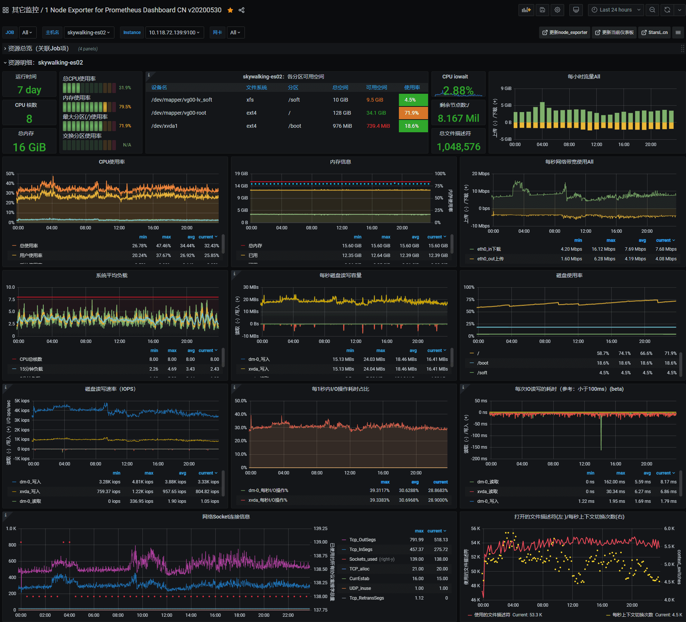
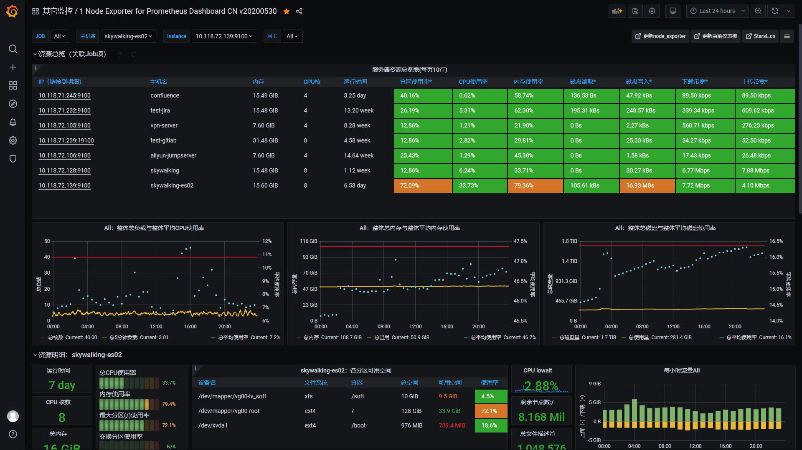
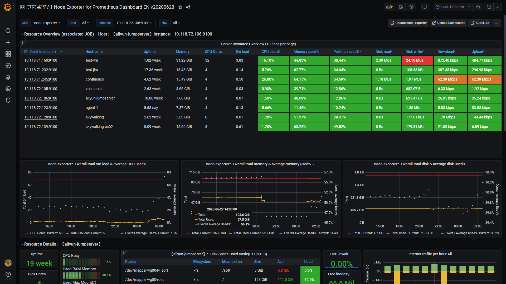
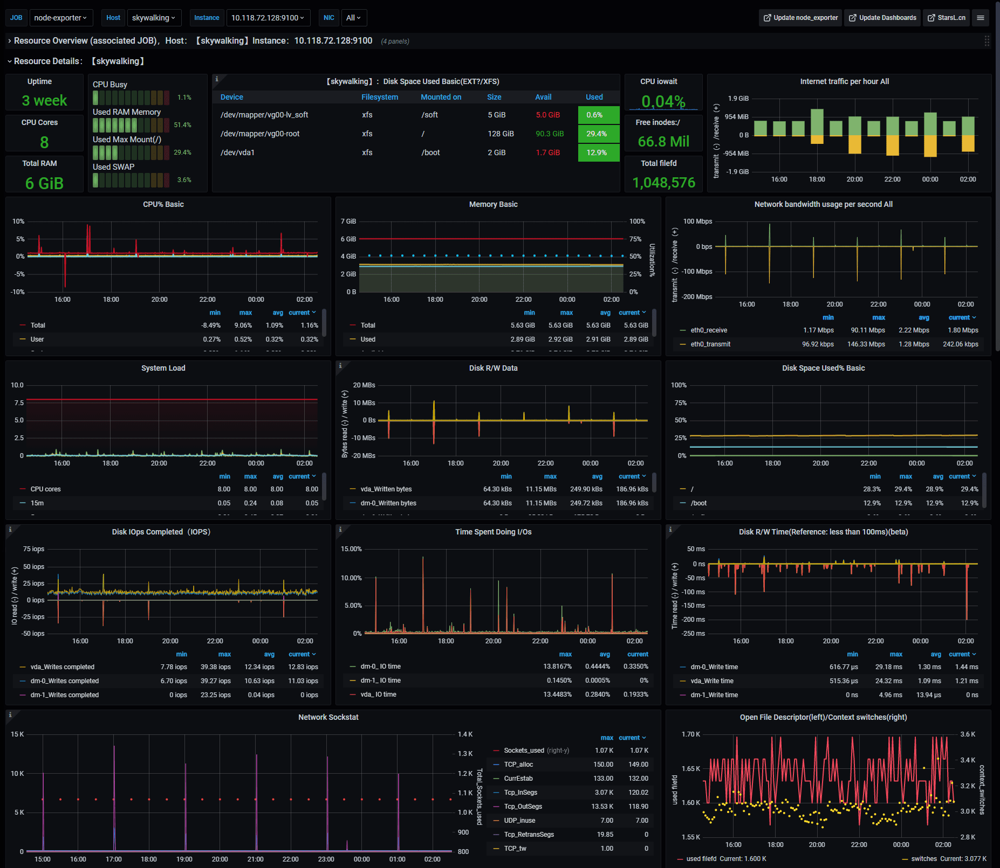
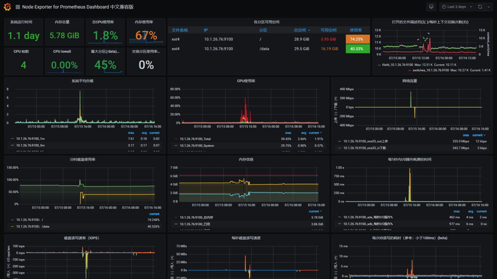
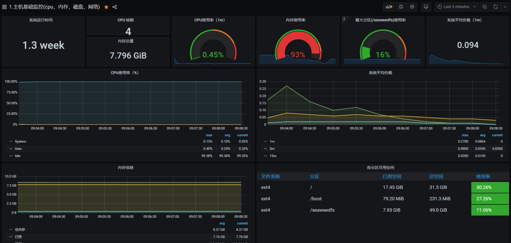
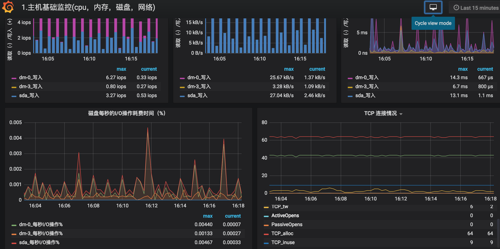

## 1.Prometheus监控模板

- [Dashboard模板仓库官网][1]

- [Node Exporter for Prometheus Dashboard CN v20200628][2]| [点击下载][3]

- [Node Exporter for Prometheus Dashboard EN v20200628][4]| [点击下载][5]

- [Node Exporter for Prometheus Dashboard 中文兼容版][6]| [点击下载][7]

- [1.主机基础监控(cpu，内存，磁盘，网络)][8]| [点击下载][9]

## 2.注意
- 模板插件对Grafana版本有要求，请对比官网的版本需求进行选择安装！
- grafana使用7的版本的话，不需要使用兼容版，否则界面会有报错问题

[1]: https://grafana.com/grafana/dashboards
[2]: https://grafana.com/grafana/dashboards/8919
[3]: https://grafana.com/api/dashboards/1860/revisions/20/download
[4]: https://grafana.com/grafana/dashboards/11074
[5]: https://grafana.com/api/dashboards/11074/revisions/4/download
[6]: https://grafana.com/grafana/dashboards/11174
[7]: https://grafana.com/api/dashboards/11174/revisions/1/download
[8]: https://grafana.com/grafana/dashboards/9276
[9]: https://grafana.com/api/dashboards/9276/revisions/2/download
