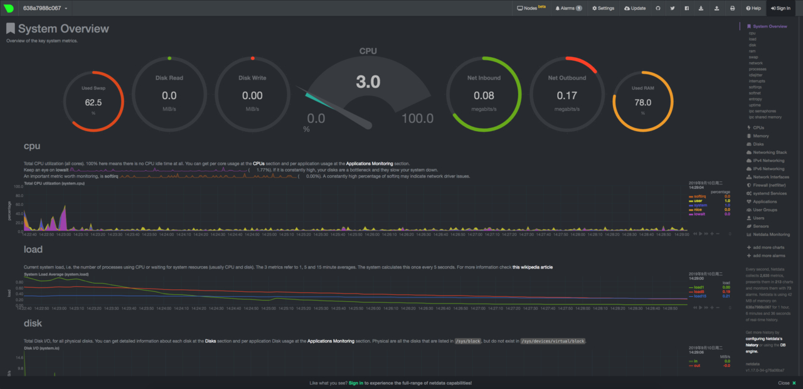
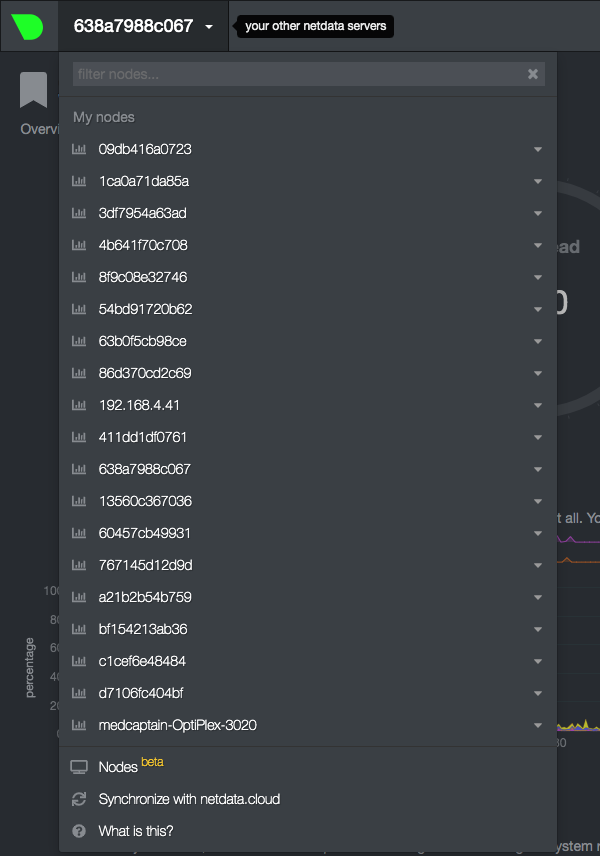

官方说明：https://docs.netdata.cloud/zh/backends/


## 安装
### installer_for_linux.sh（Linux平台通用）

```
bash <(curl -Ss https://my-netdata.io/kickstart.sh)
```
### installer_for_docker.sh（Docker平台，安装迅速快捷）

```
#!/usr/bin/env bash 
docker run -d --name=netdata \
  -p 19999:19999 \
  --restart=always \
  -v /etc/passwd:/host/etc/passwd:ro \
  -v /etc/group:/host/etc/group:ro \
  -v /proc:/host/proc:ro \
  -v /sys:/host/sys:ro \
  -v /var/run/docker.sock:/var/run/docker.sock:ro \
  --cap-add SYS_PTRACE \
  --security-opt apparmor=unconfined \
  netdata/netdata
 ```

## 界面效果

浏览器输入：http://ip-address:19999

### 总览


### CPU


### 内存


### Disk


### Network


### 用户活动


## 添加多个监控节点
点击nodes，之后用github账号登录，成功过后可以将改节点添加你的账户下并自动跳转到所有节点页面


点击其中一个节点方块，右边会自动显示该节点的一些信息


主界面点击任意节点名即可切换至该节点



点击三角箭头即可查看真实IP地址和端口号


