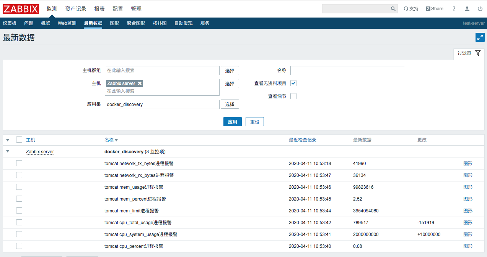
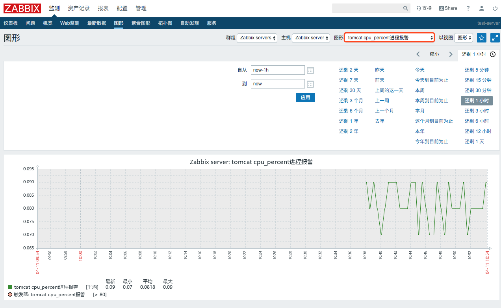
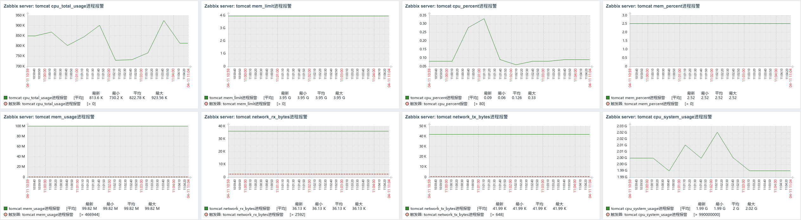

## 1.zabbix配置

- /etc/zabbix/zabbix_agentd.conf

```
##允许使用用户自定义参数
UnsafeUserParameters=1
```

- /etc/sudoers

```
root	ALL=(ALL) 	ALL
zabbix  ALL=(ALL)	NOPASSWD:ALL
```

- 将zabbix用户添加到docker组中

```
gpasswd -a zabbix docker
```

### 1.1 自定义监控脚本

准备工作：使用pip安装相关模块

```
pip install simplejson
pip install docker==3.1.3
```

> 注意：pip安装的docker模块版本必须制定3.1.3，否则下面介绍的监控脚本会运行报错

- /etc/zabbix/zabbix_agentd.d/docker_discovery.py 搜集正在运行的容器名称

```
#!/usr/bin/env python
import os
import simplejson as json
t=os.popen("""sudo docker ps |grep -v 'CONTAINER ID'|awk {'print $NF'} """)
container_name = []
for container in  t.readlines():
        r = os.path.basename(container.strip())
        container_name += [{'{#CONTAINERNAME}':r}]
print json.dumps({'data':container_name},sort_keys=True,indent=4,separators=(',',':'))
```

运行结果：
```
python /etc/zabbix/zabbix_agentd.d/docker_discovery.py

{
    "data":[
        {
            "{#CONTAINERNAME}":"tomcat"
        }
    ]
}
```

- /etc/zabbix/zabbix_agentd.d/docker_monitor.py 输入容器名称和监控项，输出数据

```
#!/usr/bin/env python
import docker
import sys
import subprocess
import os

def check_container_stats(container_name,collect_item):
    container_collect=docker_client.containers.get(container_name).stats(stream=True)
    old_result=eval(container_collect.next())
    new_result=eval(container_collect.next())
    container_collect.close()
    if collect_item == 'cpu_total_usage':
        result=new_result['cpu_stats']['cpu_usage']['total_usage'] - old_result['cpu_stats']['cpu_usage']['total_usage']
    elif collect_item == 'cpu_system_usage':
        result=new_result['cpu_stats']['system_cpu_usage'] - old_result['cpu_stats']['system_cpu_usage']
    elif collect_item == 'cpu_percent':
        cpu_total_usage=new_result['cpu_stats']['cpu_usage']['total_usage'] - old_result['cpu_stats']['cpu_usage']['total_usage']
        cpu_system_uasge=new_result['cpu_stats']['system_cpu_usage'] - old_result['cpu_stats']['system_cpu_usage']
        cpu_num=len(old_result['cpu_stats']['cpu_usage']['percpu_usage'])
        result=round((float(cpu_total_usage)/float(cpu_system_uasge))*cpu_num*100.0,2)
    elif collect_item == 'mem_usage':
        result=new_result['memory_stats']['usage']
    elif collect_item == 'mem_limit':
        result=new_result['memory_stats']['limit']
    elif collect_item == 'network_rx_bytes':
        result=new_result['networks']['eth0']['rx_bytes']
    elif collect_item == 'network_tx_bytes':
        result=new_result['networks']['eth0']['tx_bytes']
    elif collect_item == 'mem_percent':
        mem_usage=new_result['memory_stats']['usage']
        mem_limit=new_result['memory_stats']['limit']
        result=round(float(mem_usage)/float(mem_limit)*100.0,2)
    return result
if __name__ == "__main__":
    docker_client = docker.DockerClient(base_url='unix://run/docker.sock', version='1.27')
    container_name=sys.argv[1]
    collect_item=sys.argv[2]
    print check_container_stats(container_name,collect_item)
```

运行结果：

```
python docker_monitor.py tomcat cpu_percent
0.1
python docker_monitor.py tomcat mem_percent
2.52
```

### 1.2 自定义监控配置文件

- /etc/zabbix/zabbix_agentd.d/docker_discovery.conf

```
UserParameter=docker_discovery,python /etc/zabbix/zabbix_agentd.d/docker_discovery.py
UserParameter=docker_status[*],python /etc/zabbix/zabbix_agentd.d/docker_monitor.py $1 $2
```

### 1.3 重启zabbix-agent并测试
```
#监控主机上执行
systemctl restart zabbix-agent
```

```
#zabbix服务器上执行，在监控主机上执行会提示无权限
zabbix_get -s 127.0.0.1 -p 10050 -k "docker_status[tomcat cpu_percent]"
0.16
zabbix_get -s 127.0.0.1 -p 10050 -k "docker_status[tomcat mem_percent]"
2.52
```

### 1.3 导入docker监控模板

- [Docker-Template.xml](https://raw.githubusercontent.com/Leif160519/centos-script/master/zabbix/Docker/template/Docker-Template.xml)


## 2. 效果






## 3.问题解决

若遇到权限问题：
```
zabbix_get -s 127.0.0.1 -p 10050 -k "docker_status[netdata cpu_percent]"
Traceback (most recent call last):
  File "/etc/zabbix/zabbix_agentd.d/docker_monitor.py", line 38, in <module>
    print check_container_stats(container_name,collect_item)
  File "/etc/zabbix/zabbix_agentd.d/docker_monitor.py", line 8, in check_container_stats
    container_collect=docker_client.containers.get(container_name).stats(stream=True)
  File "/usr/lib/python2.7/site-packages/docker/models/containers.py", line 833, in get
    resp = self.client.api.inspect_container(container_id)
  File "/usr/lib/python2.7/site-packages/docker/utils/decorators.py", line 19, in wrapped
    return f(self, resource_id, *args, **kwargs)
  File "/usr/lib/python2.7/site-packages/docker/api/container.py", line 721, in inspect_container
    self._get(self._url("/containers/{0}/json", container)), True
  File "/usr/lib/python2.7/site-packages/docker/utils/decorators.py", line 46, in inner
    return f(self, *args, **kwargs)
  File "/usr/lib/python2.7/site-packages/docker/api/client.py", line 194, in _get
    return self.get(url, **self._set_request_timeout(kwargs))
  File "/usr/lib/python2.7/site-packages/requests/sessions.py", line 543, in get
    return self.request('GET', url, **kwargs)
  File "/usr/lib/python2.7/site-packages/requests/sessions.py", line 530, in request
    resp = self.send(prep, **send_kwargs)
  File "/usr/lib/python2.7/site-packages/requests/sessions.py", line 643, in send
    r = adapter.send(request, **kwargs)
  File "/usr/lib/python2.7/site-packages/requests/adapters.py", line 498, in send
    raise ConnectionError(err, request=request)
requests.exceptions.ConnectionError: ('Connection aborted.', error(13, 'Permission denied'))
```

请检测zabbix-agent机器的`selinux`是否处于关闭状态：
```
[root@online-12 ~]# sestatus
SELinux status:                 disabled
[root@online-12 ~]# getenforce
Disabled
```

若显示`Permissive`或`enabled`状态，则需要关闭selinux：
```
[root@data-backup zabbix_agentd.d]# sestatus
SELinux status:                 enabled
SELinuxfs mount:                /sys/fs/selinux
SELinux root directory:         /etc/selinux
Loaded policy name:             targeted
Current mode:                   permissive
Mode from config file:          disabled
Policy MLS status:              enabled
Policy deny_unknown status:     allowed
Max kernel policy version:      31
[root@data-backup zabbix_agentd.d]# getenforce
Permissive
```

关闭方法：

- 临时关闭：

```
[root@localhost ~]# setenforce 0
```

- 永久关闭,可以修改配置文件/etc/selinux/config,将其中SELINUX设置为disabled，之后重启电脑即可生效。

```
[root@localhost ~]# cat /etc/selinux/config   
   
# This file controls the state of SELinux on the system.  
# SELINUX= can take one of these three values:  
#     enforcing - SELinux security policy is enforced.  
#     permissive - SELinux prints warnings instead of enforcing.  
#     disabled - No SELinux policy is loaded.  
#SELINUX=enforcing  
SELINUX=disabled  
# SELINUXTYPE= can take one of three two values:  
#     targeted - Targeted processes are protected,  
#     minimum - Modification of targeted policy. Only selected processes are protected.   
#     mls - Multi Level Security protection.  
SELINUXTYPE=targeted
 
[root@rdo ~]# sestatus  
SELinux status:                 disabled
```

> 若上述操作中没有将zabbix用户添加进docker组中，执行命令后必须得重启zabbix-agent才能生效

## 4.参考

- [【监控】zabbix监控docker容器](https://blog.csdn.net/qq_33633013/article/details/83503804)
- [docker.from_env() causes TypeError: load_config() got an unexpected keyword argument 'config_dict' #1916](https://github.com/docker/docker-py/issues/1916)
- [centos 7.0 查看selinux状态|关闭|开启](https://blog.csdn.net/edide/article/details/52389946)
