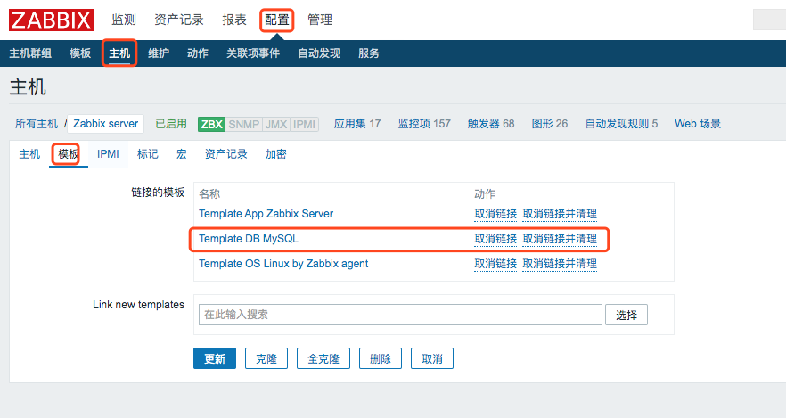
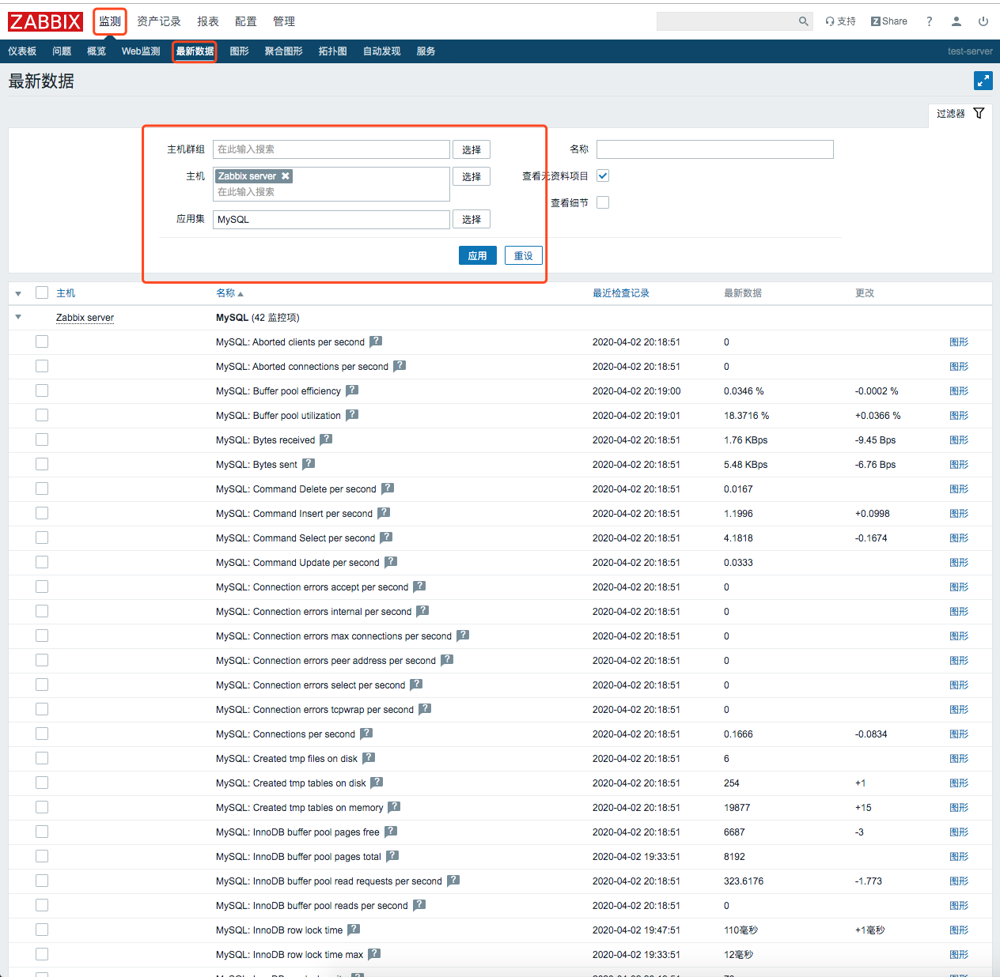
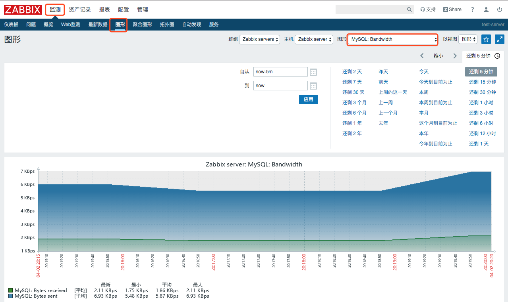
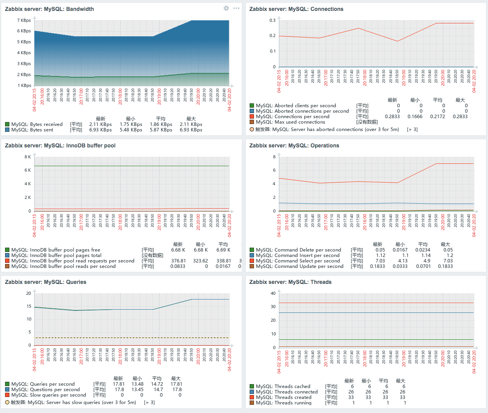

## 1. 关联mysql模版

步骤：`配置` > `主机` > `点击主机的主机` > `模版`


点击那个模版进去看看模版的描述
```
Requirements for template operation:
1.Install Zabbix agent and MySQL client.
2.Copy Template_DB_MySQL.conf into folder with Zabbix agent configuration (/etc/zabbix/zabbix_agentd.d/ by default). Don't forget restart zabbix-agent. 
3.Create MySQL user for monitoring. For example:
CREATE USER 'zbx_monitor'@'%' IDENTIFIED BY '<password>';
GRANT USAGE,REPLICATION CLIENT,PROCESS,SHOW DATABASES,SHOW VIEW ON *.* TO 'zbx_monitor'@'%';
For more information read the MYSQL documentation https://dev.mysql.com/doc/refman/8.0/en/grant.html , please. 
4.Create .my.cnf in home directory of Zabbix agent for Linux (/var/lib/zabbix by default ) or my.cnf in c:\ for Windows. For example:
[client]
user=zbx_monitor
password=<password>
```
由此可得，关联mysql模板还需要创建检测用户和相关模板文件。


## 2. 设置模版mysql端

### 2.1 在mysql中创建检测用户
```
mysql> CREATE USER 'zbx_monitor'@'%' IDENTIFIED BY 'zabbix';
mysql> GRANT USAGE,REPLICATION CLIENT,PROCESS,SHOW DATABASES,SHOW VIEW ON *.* TO 'zbx_monitor'@'%';
mysql> flush privileges;
```

### 2.2 查看zabbix中的mysql监控模板
```
[root@test-server zabbix]# find / -name userparameter_mysql.conf
/etc/zabbix/zabbix_agentd.d/userparameter_mysql.conf
/usr/share/doc/zabbix-agent-4.4.7/userparameter_mysql.conf
```

### 2.3 拷贝到zabbix_agentd.conf.d/目录下并重命名为mysql.conf

```
cp /etc/zabbix/zabbix_agentd.d/userparameter_mysql.conf  /etc/zabbix/zabbix_agentd.d/mysql.conf
```

### 2.4 测试模版是否有效
```
[root@test-server zabbix_agentd.d]# zabbix_agentd -t mysql.ping -c /etc/zabbix/zabbix_agentd.d/mysql.conf
mysql.ping                                    [m|ZBX_NOTSUPPORTED] [Unsupported item key.]
```

### 2.5 模版修改
修改`/etc/zabbix/zabbix_agentd.d/mysql.conf`

```
UserParameter=mysql.ping[*], HOME=/etc/zabbix mysqladmin ping

UserParameter=mysql.get_status_variables[*],HOME=/etc/zabbix mysql -sNX -e "show global status"
UserParameter=mysql.version[*],HOME=/etc/zabbix mysqladmin version
UserParameter=mysql.uptime,HOME=/etc/zabbix mysqladmin status | cut -f2 -d ":" | cut -f1 -d "T" | tr -d " "

UserParameter=mysql.db.discovery[*],HOME=/etc/zabbix mysql -sN -e "show databases"
UserParameter=mysql.dbsize[*], HOME=/etc/zabbix mysql -sN -e "SELECT SUM(DATA_LENGTH + INDEX_LENGTH) FROM INFORMATION_SCHEMA.TABLES WHERE TABLE_SCHEMA='$3'"
UserParameter=mysql.replication.discovery[*], HOME=/etc/zabbix  mysql -sNX -e "show slave status"
UserParameter=mysql.slave_status[*], HOME=/etc/zabbix  mysql -sNX -e "show slave status"
```

### 2.6 配置.my.cnf
在`/etc/zabbix`下新建`.my.cnf`,内容如下：
```
[client]
user=zbx_monitor
password=zabbix
[mysql]
user=zbx_monitor
password=zabbix
[mysqladmin]
user=zbx_monitor
password=zabbix
```

### 2.7 重启动zabbix_agentd
```
systemctl restart zabbix-agent
```

### 2.8 看数据在监测 > 最新数据


### 2.9 看图标在监测 > 图形里


### 2.10 最终效果预览


## 3.参考
[3分钟配置zabbix 监控mysql](https://my.oschina.net/u/3947618/blog/3210184)
