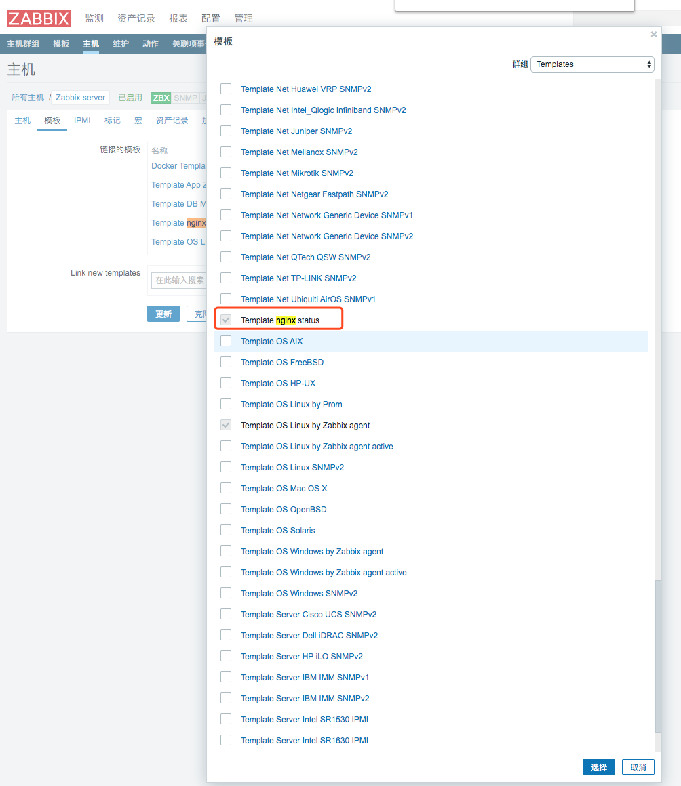
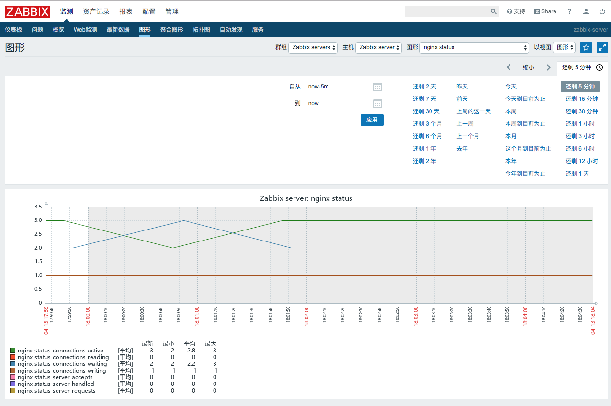

## 1. 启用nginx status配置
在location添加下列内容：
```
server {
    location /ngx_status
    {
        stub_status on;
        access_log off;
        allow 127.0.0.1;
        deny all;
    }
}
```

示例：
```
······
    server {
        listen 80;
        server_name example.com;
       
       location / {
            proxy_set_header X-Real-IP $remote_addr;
            proxy_set_header Host $http_host;
            proxy_pass http://127.0.0.1:8080;
        }

        location /goaccess {
            root /usr/local/src;
        }

        location /ngx_status
        {
            stub_status on;
            access_log off;
            allow 127.0.0.1;
        }
        
······
```

## 2. 重载nginx
```
ngixn -s reload
```

## 3. 打开status页面
```
curl http://127.0.0.1/ngx_status
Active connections: 3
server accepts handled requests
 123630 123630 477618
Reading: 0 Writing: 1 Waiting: 2
```

> 若启用https和域名访问，则直接将IP地址换成域名：`curl https://domain/ngx_status`

## 4. nginx status详解
- active connections – 活跃的连接数量
- server accepts handled requests — 总共处理了11989个连接 , 成功创建11989次握手, 总共处理了11991个请求
- reading — 读取客户端的连接数.
- writing — 响应数据到客户端的数量
- waiting — 开启 keep-alive 的情况下,这个值等于 active – (reading+writing), 意思就是 Nginx 已经处理完正在等候下一次请求指令的驻留连接.

以上为nginx性能计数，我们除了监控以上数据，还需要监控nginx进程状态，并且配置触发器

## 2.zabbix客户端配置
### 2.1 编写客户端脚本

- /etc/zabbix/zabbix_agentd.d/nginx_status.sh

```
#!/bin/bash
HOST="127.0.0.1"
PORT="80"
# 检测nginx进程是否存在
function ping() {
	/usr/sbin/pidof nginx | wc -l
}

# 检测nginx性能

function active() {
	/usr/bin/curl "http://$HOST:$PORT/ngx_status/"  2>/dev/null | grep 'Active' | awk '{print $NF}'
}
function reading() {
	/usr/bin/curl "http://$HOST:$PORT/ngx_status/"  2>/dev/null | grep 'Reading' | awk '{print $2}'
}
function writing() {
	/usr/bin/curl "http://$HOST:$PORT/ngx_status/"  2>/dev/null | grep 'Writing' | awk '{print $4}'
}
function waiting() {
	/usr/bin/curl "http://$HOST:$PORT/ngx_status/"  2>/dev/null | grep 'Waiting' | awk '{print $6}'
}
function accepts() {
	/usr/bin/curl "http://$HOST:$PORT/ngx_status/"  2>/dev/null | awk NR==3 | awk '{print $1}'
}
function handled() {
	/usr/bin/curl "http://$HOST:$PORT/ngx_status/"  2>/dev/null | awk NR==3 | awk '{print $2}'
}
function requests() {
	/usr/bin/curl "http://$HOST:$PORT/ngx_status/"  2>/dev/null | awk NR==3 | awk '{print $3}'
}

# 执行function
$1
```

> 若采用`https`的域名方式访问，则将脚本中的`http`替换成`https`，IP地址替换成域名即可

### 2.2 添加脚本执行权限
```
chmod +x /etc/zabbix/zabbix_agentd.d/nginx_status.sh
```

### 2.3 自定义UserParameter

- /etc/zabbix/zabbix_agentd.d/nginx.conf

```
UserParameter=nginx.status[*],/etc/zabbix/zabbix_agentd.d/nginx_status.sh $1
```

### 2.4 重启zabbix-agent
```
systemctl restart zabbix-agent
```

### 2.5 zabbix_get获取数据
```
zabbix_get -s 127.0.0.1  -p 10050 -k 'nginx.status[accepts]'
123833
zabbix_get -s 127.0.0.1  -p 10050 -k 'nginx.status[ping]'
1
```

## 3.zabbix web端配置

### 3.1 导入Template App NGINX模板

- [Template nginx status.xml](https://raw.githubusercontent.com/Leif160519/centos-script/master/zabbix/Nginx/template/Template%20nginx%20status.xml)


### 3.2 添加模板



> 注意：不要添加错了，zabbix自带nginx模板不过我们不用

### 3.3 效果



## 4.参考
本文摘自：[Zabbix监控Nginx性能的实现方式](https://www.linuxidc.com/Linux/2018-11/155480.htm)
