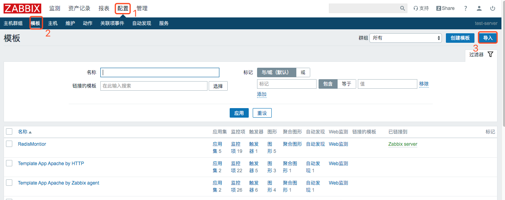
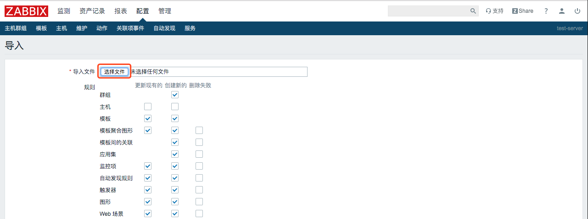
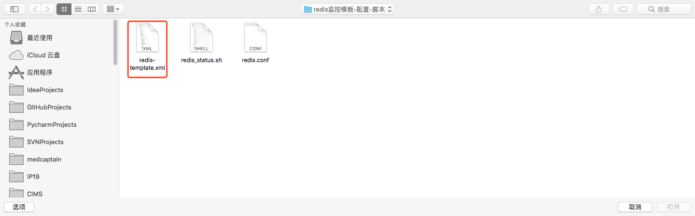
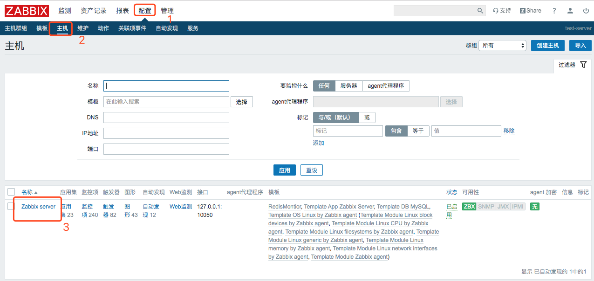
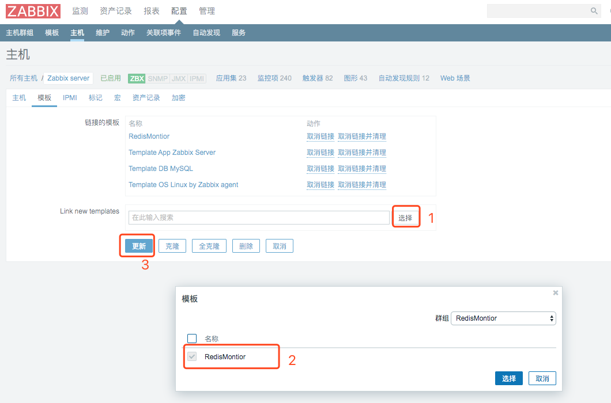
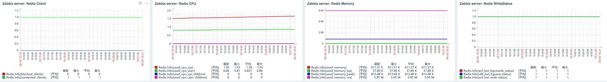

## 1.创建redis监控脚本
### 1.1 创建脚本
在`/etc/zabbix/zabbix_agentd.d/`下新建文件`redis_status.sh`,内容如下：
```
#!/bin/bash
REDISCLI="/usr/bin/redis-cli"
HOST="127.0.0.1"
PORT=6379
PASS=""

if [[ $# == 1 ]];then
    case $1 in
        version)
            result=`$REDISCLI -h $HOST  -p $PORT info server | grep -w "redis_version" | awk -F':' '{print $2}'`
            echo $result
        ;;
        uptime)
            result=`$REDISCLI -h $HOST  -p $PORT info server | grep -w "uptime_in_seconds" | awk -F':' '{print $2}'`
            echo $result
        ;;
        connected_clients)
            result=`$REDISCLI -h $HOST  -p $PORT info clients | grep -w "connected_clients" | awk -F':' '{print $2}'`
            echo $result
        ;;
        blocked_clients)
            result=`$REDISCLI -h $HOST  -p $PORT info clients | grep -w "blocked_clients" | awk -F':' '{print $2}'`
            echo $result
        ;;
        used_memory)
            result=`$REDISCLI -h $HOST  -p $PORT info memory | grep -w "used_memory" | awk -F':' '{print $2}'`
            echo $result
        ;;
        used_memory_rss)
            result=`$REDISCLI -h $HOST  -p $PORT info memory | grep -w "used_memory_rss" | awk -F':' '{print $2}'`
            echo $result
        ;;
        used_memory_peak)
            result=`$REDISCLI -h $HOST  -p $PORT info memory | grep -w "used_memory_peak" | awk -F':' '{print $2}'`
            echo $result
        ;;
        used_memory_lua)
            result=`$REDISCLI -h $HOST  -p $PORT info memory | grep -w "used_memory_lua" | awk -F':' '{print $2}'`
            echo $result
        ;;
        used_cpu_sys)
            result=`$REDISCLI -h $HOST  -p $PORT info cpu | grep -w "used_cpu_sys" | awk -F':' '{print $2}'`
            echo $result
        ;;
        used_cpu_user)
            result=`$REDISCLI -h $HOST  -p $PORT info cpu | grep -w "used_cpu_user" | awk -F':' '{print $2}'`
            echo $result
        ;;
        used_cpu_sys_children)
            result=`$REDISCLI -h $HOST  -p $PORT info cpu | grep -w "used_cpu_sys_children" | awk -F':' '{print $2}'`
            echo $result
        ;;
        used_cpu_user_children)
            result=`$REDISCLI -h $HOST  -p $PORT info cpu | grep -w "used_cpu_user_children" | awk -F':' '{print $2}'`
            echo $result
        ;;
        rdb_last_bgsave_status)
            result=`$REDISCLI -h $HOST  -p $PORT info Persistence | grep -w "rdb_last_bgsave_status" | awk -F':' '{print $2}' | grep -c ok`
            echo $result
        ;;
        aof_last_bgrewrite_status)
            result=`$REDISCLI -h $HOST  -p $PORT info Persistence | grep -w "aof_last_bgrewrite_status" | awk -F':' '{print $2}' | grep -c ok`
            echo $result
        ;;
        aof_last_write_status)
            result=`$REDISCLI -h $HOST  -p $PORT info Persistence | grep -w "aof_last_write_status" | awk -F':' '{print $2}' | grep -c ok`
            echo $result
        ;;
        *)
            echo -e "\033[33mUsage: $0 {connected_clients|blocked_clients|used_memory|used_memory_rss|used_memory_peak|used_memory_lua|used_cpu_sys|used_cpu_user|used_cpu_sys_children|used_cpu_user_children|rdb_last_bgsave_status|aof_last_bgrewrite_status|aof_last_write_status}\033[0m"
        ;;
    esac
elif [[ $# == 2 ]];then
    case $2 in
        keys)
            result=`$REDISCLI -h $HOST  -p $PORT info | grep -w "$1" | grep -w "keys" | awk -F'=|,' '{print $2}'`
            echo $result
        ;;
        expires)
            result=`$REDISCLI -h $HOST  -p $PORT info | grep -w "$1" | grep -w "keys" | awk -F'=|,' '{print $4}'`
            echo $result
        ;;
        avg_ttl)
            result=`$REDISCLI -h $HOST  -p $PORT info | grep -w "$1" | grep -w "avg_ttl" | awk -F'=|,' '{print $6}'`
            echo $result
        ;;
        *)
            echo -e "\033[33mUsage: $0 {db0 keys|db0 expires|db0 avg_ttl}\033[0m" 
        ;;
    esac
fi

```

> 注意：若redis有密码，则需要在`$HOST`后加上`-a $PASS`参数。

### 1.2 赋予脚本可执行权限
`chmod +x /etc/zabbix/zabbix_agentd.d/redis_status.sh`

### 1.3 脚本测试
```
[root@test-server zabbix_agentd.d]# bash redis_status.sh version
3.2.12
```

## 2.创建redis监控配置文件
### 2.1 创建文件
在 ` /etc/zabbix/zabbix_agentd.d`下新建`redis.conf`文件，内容如下：
```
UserParameter=Redis.Status,status=`/usr/local/bin/redis-cli -h 127.0.0.1 -p 6379 ping|grep -c PONG` &&echo $status
UserParameter=Redis.Info[*],/etc/zabbix/zabbix_agentd.d/redis_status.sh $1 $2
```

### 2.2 重启`zabbix-agent`:
```
systemctl restart zabbix-agent
```

## 3.创建并导入监控模板
### 3.1 创建监控模板
redis-template.xml文件内容参考[github](https://raw.githubusercontent.com/Leif160519/centos-script/master/zabbix/Redis/template/redis-template.xml)：

 ### 3.2 导入监控模板（不用zabbix自带的redis模板）
 
 `配置`-`模板`-`导入`
 


点击`选择文件`，找到`redis-template.xml`文件，将其导入






## 4.给主机添加监控模板




监控效果如图：



## 5.参考
[线上zabbix监控redis和redis集群](https://blog.51cto.com/13120271/2317181)

有兴趣的可以尝试[官方提供的redis监控方式](https://share.zabbix.com/databases/db_redis/redis-for-zabbix4-4)，[github地址](https://github.com/cloudtemple/zabbix_templates)
